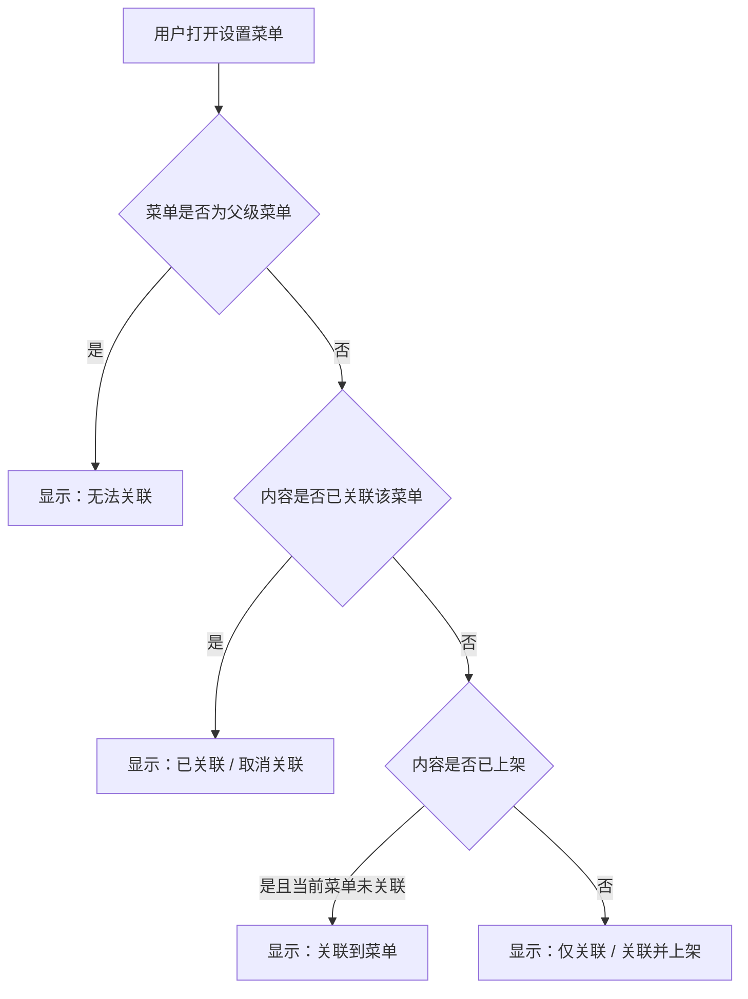
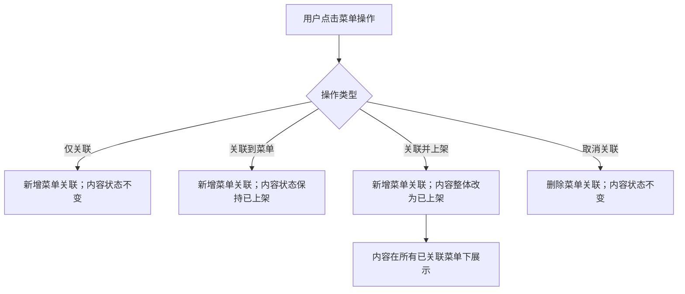
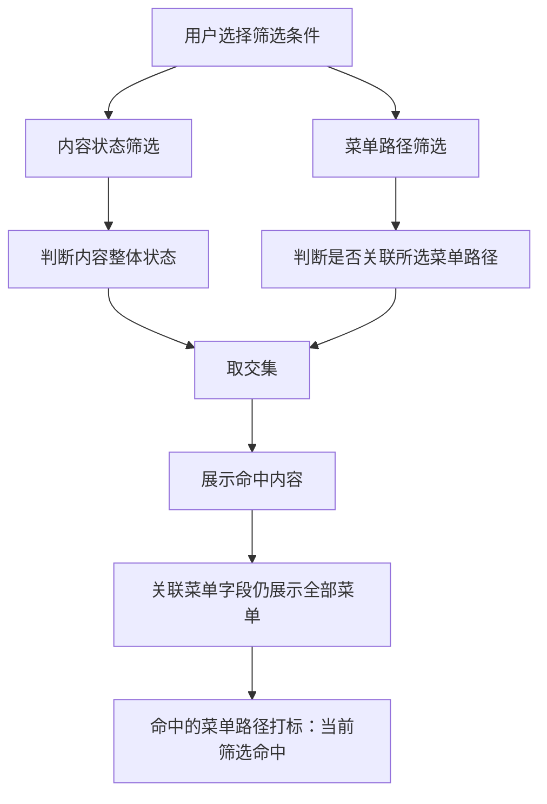

# 视频管理：内容多菜单关联与内容状态上架 PRD

## 1. 文档信息

| 项目 | 内容 |
| --- | --- |
| 文档名称 | 视频管理：内容多菜单关联与内容状态上架 |
| 版本 | V1.1 |
| 日期 | 2026-06-22 |
| 适用页面 | 商户后台 - 视频管理 |
| 相关原型 | `video-management.html` |

## 2. 本次新增/变更内容

1. 内容支持关联多个菜单：同一条内容可以绑定多个末级菜单。
2. 关联菜单字段改造：列表展示内容已关联的全部菜单集合，默认展示前 2 条，超过 2 条显示 `+N 查看全部`。
3. 查看全部弹窗：点击后展示该内容所有关联菜单路径。
4. 设置菜单弹窗：父级菜单显示“无法关联”，末级菜单根据内容状态展示可操作按钮。
5. 批量绑定菜单弹窗：显示内容数量、当前项目、目标菜单树，操作规则与设置菜单保持一致。
6. 筛选逻辑收敛：保留“内容状态”和菜单筛选，不再引入“当前菜单状态”。
7. 批量内容数量上限：内容数量最大值按现有代码能力收敛为 `1000`。
8. 原型内置 PRD：右上角提供 `PRD` 按钮，方便评审、开发、测试查看。

## 3. 背景

当前视频管理原逻辑偏向“一条内容只关联一个菜单”。业务希望一条内容可以投放到多个菜单位置，例如同一条视频同时出现在“首页推荐”“动漫专区”“经典合集”等菜单下。

同时，原讨论中出现过“菜单维度上架状态”的方案，但该方案会让运营同时理解“内容状态”和“菜单状态”两套状态，容易造成操作混淆。因此本版收敛为：菜单只表示内容展示位置，内容是否展示由内容整体上架状态统一控制。

## 4. 目标

1. 支持一条内容关联多个菜单。
2. 保持运营理解简单：只需要理解“内容是否上架”和“内容挂在哪些菜单”。
3. 设置菜单弹窗与列表中的关联菜单字段形成联动。
4. 筛选时能明确看出当前命中的菜单，同时不隐藏其他已关联菜单。

## 5. 核心概念

| 概念 | 说明 |
| --- | --- |
| 内容 | 视频列表中的单条视频内容。 |
| 内容状态 | 内容整体的上架状态，决定内容是否在网站展示。 |
| 菜单 | 前台展示内容的导航或分类位置，支持多级结构。 |
| 关联菜单 | 某条内容已经绑定的一个菜单节点。 |
| 菜单路径 | 从一级菜单到目标菜单的完整路径。 |
| 仅关联 | 只新增菜单关联，不改变内容当前上架状态。 |
| 关联到菜单 | 仅在“内容已上架 + 当前菜单未关联”时展示的关联按钮，含义等同于“仅关联”。 |
| 关联并上架 | 新增菜单关联，并将内容整体状态更新为已上架。 |
| 取消关联 | 解除内容和某个菜单的绑定关系。 |

## 6. 业务规则

### 6.1 内容与菜单关系

1. 一条内容可以关联多个菜单。
2. 同一条内容不可重复关联同一个菜单路径。
3. 菜单关联关系只记录内容绑定了哪些菜单。
4. 菜单不单独维护“已上架 / 未上架”状态。
5. 内容已上架后，会在所有已关联菜单下展示。
6. 内容未上架时，即使已经关联菜单，也不会在网站展示。
7. 内容已上架但没有任何关联菜单时，内容状态仍为已上架，但前台没有菜单入口展示。
8. “关联并上架”更新的是内容整体状态，因此会影响该内容所有已关联菜单的展示。
9. “关联到菜单”的前置条件是内容整体状态已上架，且目标末级菜单当前未关联；如果内容未上架，不展示该按钮。

### 6.2 菜单可关联规则

1. 父级菜单不允许关联内容，只用于层级展示。
2. 判断标准不是菜单级数，而是该菜单是否有子菜单。
3. 有子菜单的节点统一视为父级菜单，操作列显示“无法关联”。
4. 没有子菜单的末级菜单才允许关联内容。

### 6.3 操作规则

操作展示前置判断：系统先判断目标菜单是否可关联，再判断内容是否已关联该菜单，最后判断内容整体状态。只有“可关联末级菜单 + 未关联 + 内容已上架”时展示“关联到菜单”。

| 场景 | 操作展示 | 结果 |
| --- | --- | --- |
| 未上架内容，未关联末级菜单 | 仅关联 / 关联并上架 | 仅关联不改内容状态；关联并上架会把内容状态改为已上架。 |
| 内容已上架 + 当前菜单未关联 | 关联到菜单 | 新增菜单关联，内容状态保持已上架，关联后会在该菜单展示。 |
| 已关联末级菜单 | 已关联 / 取消关联 | 取消关联只删除菜单关系，不改变内容状态。 |
| 父级菜单 | 无法关联 | 不允许绑定内容。 |

### 6.4 多选规则

1. 多选内容时，操作会应用到所有已选内容。
2. 如果选中内容里存在未上架内容，未关联末级菜单展示“仅关联 / 关联并上架”。
3. 如果选中内容全部已上架，未关联末级菜单只展示“关联到菜单”。
4. 点击“仅关联”时，所有已选内容新增菜单关联，内容状态保持原状。
5. 点击“关联并上架”时，所有已选内容新增菜单关联，并统一更新为已上架。
6. 点击“取消关联”时，所有已选内容删除该菜单关联，内容状态保持原状。

## 7. 业务流程图

### 7.1 设置菜单按钮展示

### 7.2 操作结果

### 7.3 筛选展示

## 8. 页面需求

### 8.1 视频列表 - 关联菜单字段

列表中的“关联菜单”字段展示该内容当前已关联的菜单集合。

1. 默认最多展示 2 条菜单路径。
2. 如果关联菜单数量大于 2 条，展示 `+N 查看全部`。
3. 如果关联菜单数量小于或等于 2 条，不展示“查看全部”。
4. 未关联任何菜单时，显示 `未关联`。
5. 按菜单筛选后，命中的菜单路径展示“当前筛选命中”标记。
6. 字段不展示菜单维度的已上架/未上架状态。

### 8.2 查看全部弹窗

点击 `+N 查看全部` 后，展示该内容全部已关联菜单路径。

弹窗不展示“列表展示”等内部说明文案，也不展示菜单维度状态。

### 8.3 设置菜单弹窗

1. 入口位于视频列表批量操作区域中的 `设置菜单` 按钮。
2. 未勾选内容时，按钮置灰不可点击。
3. 勾选至少 1 条内容后，按钮高亮可点击。
4. 弹窗按菜单树展示。
5. 父级菜单显示“无法关联”。
6. 未上架内容的未关联末级菜单显示“仅关联 / 关联并上架”。
7. 只有“内容已上架 + 当前菜单未关联”时，才显示“关联到菜单”。
8. 已关联末级菜单显示“已关联 / 取消关联”。
9. 弹窗顶部需要说明：“菜单只表示内容展示位置；内容是否展示由内容状态统一控制。”
10. 弹窗顶部需要说明：“关联并上架会将内容整体状态更新为已上架，并在所有已关联菜单下展示。”

### 8.4 批量绑定菜单弹窗

1. 点击 `批量绑定菜单` 后打开弹窗。
2. 弹窗展示内容数量输入框、当前项目、目标菜单树。
3. 内容数量最大值为 1000。
4. 弹窗规则说明需要展示当前已选内容的上架状态判断，说明为什么展示“关联到菜单”或“仅关联 / 关联并上架”。
5. 如果已选内容全部已上架，未关联末级菜单只展示“关联到菜单”。
6. 如果已选内容里存在未上架内容，或未明确选择内容，末级菜单保留“仅关联 / 关联并上架”。
7. 点击“仅关联”表示只新增菜单关联，不改变内容状态。
8. 点击“关联并上架”表示新增菜单关联，并将命中的内容整体状态更新为已上架。
9. 弹窗内需要展示批量规则说明，避免用户误认为“关联并上架”是菜单维度状态。

## 9. 筛选逻辑

### 9.1 菜单筛选

1. 页面顶部支持按一级、二级、三级、四级菜单进行筛选。
2. 内容只要关联了筛选条件对应的菜单路径，即命中筛选。
3. 若内容关联了多个菜单，筛选不同菜单时，同一条内容可能在多个结果中出现。
4. 筛选后，列表中的“关联菜单”字段仍展示该内容全部已关联菜单，而不是只展示当前筛选命中的菜单。
5. 当前筛选命中的菜单需要展示“当前筛选命中”标记。

### 9.2 内容状态筛选

1. 内容状态筛选代表内容整体上架状态。
2. 内容状态与菜单筛选取交集。
3. 示例：选择“内容状态=已上架”且选择“一级菜单A / 二级菜单B”，列表展示已上架并且关联该菜单路径的内容。
4. 示例：选择“内容状态=未上架”且选择“一级菜单A / 二级菜单B”，列表展示未上架但已经关联该菜单路径的内容。

## 10. 交互流程

### 10.1 未上架内容仅关联

1. 用户勾选未上架内容A。
2. 点击 `设置菜单`。
3. 在未关联末级菜单点击 `仅关联`。
4. 系统新增内容A与该菜单的关联关系。
5. 内容A仍为未上架，不在网站展示。

### 10.2 未上架内容关联并上架

1. 用户勾选未上架内容A。
2. 点击 `设置菜单`。
3. 在未关联末级菜单点击 `关联并上架`。
4. 系统新增内容A与该菜单的关联关系。
5. 内容A整体状态更新为已上架，并在所有已关联菜单下展示。

### 10.3 已上架内容关联未关联菜单

1. 用户勾选已上架内容A。
2. 点击 `设置菜单`。
3. 当前菜单未关联时，末级菜单只显示 `关联到菜单`。
4. 用户点击后，系统新增菜单关联。
5. 内容A保持已上架，并在新菜单下展示。

### 10.4 取消关联

1. 用户勾选内容A。
2. 点击 `设置菜单`。
3. 已关联菜单显示 `已关联 / 取消关联`。
4. 用户点击 `取消关联`。
5. 系统删除该菜单关联关系，不改变内容整体上架状态。

## 11. 验收标准

1. 内容无关联菜单时，列表显示“未关联”。
2. 内容关联 1 条菜单时，展示 1 条菜单路径。
3. 内容关联 2 条菜单时，展示 2 条菜单路径，不展示“查看全部”。
4. 内容关联超过 2 条菜单时，展示前 2 条，并显示 `+N 查看全部`。
5. 点击“查看全部”后，弹窗展示全部菜单路径。
6. 按菜单筛选后，命中的关联菜单展示“当前筛选命中”标记。
7. 未勾选内容时，设置菜单按钮不可点击。
8. 勾选内容后，设置菜单按钮高亮可点击。
9. 未上架内容的未关联末级菜单显示“仅关联 / 关联并上架”。
10. 只有“内容已上架 + 当前菜单未关联”时，未关联末级菜单才显示“关联到菜单”。
11. 已关联菜单显示“已关联 / 取消关联”。
12. 批量绑定菜单弹窗需要展示当前已选内容状态判断，避免用户误以为按钮没有更新。
13. 点击“仅关联”或“关联到菜单”后，列表字段新增对应菜单，内容状态保持不变。
14. 点击“关联并上架”后，列表字段新增对应菜单，并将内容状态更新为已上架。
15. 点击“取消关联”后，列表字段移除对应菜单，内容状态保持不变。
16. 多选内容包含未上架内容时，设置菜单弹窗展示“仅关联 / 关联并上架”。
17. “关联并上架”后，该内容在所有已关联菜单下展示。
18. 内容已上架但无关联菜单时，内容状态保持已上架，但前台无菜单入口展示。
